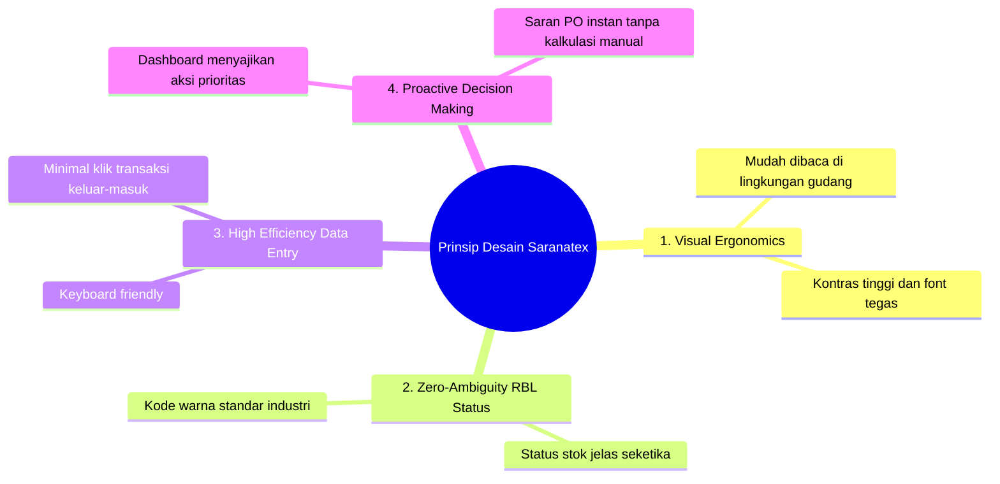

# Desain Sistem & Panduan UI/UX (DESAIN.MD)
## Desain Antarmuka, Sistem Visual & Pengalaman Pengguna Berbasis RBL
**PT Saranatex (Sanartex) Textile Inventory**

---

| **Dokumen ID** | DESAIN-SANARTEX-INV-01 |
|---|---|
| **Versi** | 2.0.0 (Redesain Premium Berbasis RBL) |
| **Target Platform** | Filament v3, Livewire 3, Tailwind CSS, Alpine.js |
| **Format** | Responsive Web (Desktop 1920x1080 & Tablet Gudang 1024x768) |

---

## 1. Filosofi & Prinsip Desain UI/UX

Desain antarmuka sistem inventori PT Saranatex dirancang berdasarkan 4 pilar utama:



1. **Zero-Ambiguity (Kejelasan Mutlak):** Status kesehatan stok (Kritis, Normal, Berlebih) dapat diidentifikasi oleh staf gudang dalam waktu kurang dari 1 detik menggunakan kode warna dan *progress bar* yang intuitif.
2. **Warehouse-Ergonomic:** Komponen input transaksi didesain dengan target sentuh besar, kontras tinggi, dan navigasi ramah *keyboard/barcode scanner*.
3. **Data Density & Cleanliness:** Informasi lengkap (Kode kain, kategori, stok roll/yard, lokasi rak) disajikan rapi tanpa kesan sesak (*cluttered*).
4. **Modern & Premium Aesthetics:** Menggunakan estetika modern dengan *micro-interactions*, *glassmorphism* lembut, palet warna elegan, dan tipografi modern (Inter / Plus Jakarta Sans).

---

## 2. Sistem Warna & Zonasi RBL (Color Tokens & Theme)

### 2.1 Palet Semantik Status Stok RBL (3 Zona)

| Zona Buffer RBL | Nama Status | Warna Utama | HEX Code | Background Tint | Arti Operasional |
|---|---|---|---|---|---|
| 🔴 **Zona Merah** | **KRITIS** | Rose / Red 500 | `#EF4444` | `#FEF2F2` (Red-50) | Stok $\le$ Batas Min. **Tindakan: Segera Terbitkan PO!** |
| 🟢 **Zona Hijau** | **NORMAL** | Emerald 500 | `#10B981` | `#ECFDF5` (Emerald-50) | Batas Min < Stok $\le$ Maks. **Kondisi Persediaan Optimal** |
| 🔵 **Zona Biru** | **BERLEBIH** | Sky / Blue 500 | `#3B82F6` | `#EFF6FF` (Blue-50) | Stok > Batas Maks. **Tahan PO / Evaluasi Overstock** |

### 2.2 Palet Brand & Antarmuka
- **Primary Brand Color:** Deep Navy (`#0F172A`) & Slate (`#334155`) — Mencerminkan identitas industri tekstil berkelas, stabilitas, dan keandalan operasional.
- **Surface Background (Light Theme - Default & Utama):** `#F8FAFC` (Slate-50) & `#F1F5F9` (Slate-100) dengan kartu putih murni (`#FFFFFF`), sudut melengkung halus (*rounded-xl*), dan garis batas elegan (`#E2E8F0` / `border-slate-200`).
- **Surface Accent & Badges:** Tint lembut bertema cerah (`bg-emerald-50`, `bg-rose-50`, `bg-blue-50`).
- **Text Primary:** `#0F172A` (Slate-900) untuk keterbacaan tinggi dan ketajaman kontras (*high readability*).
- **Text Muted:** `#64748B` (Slate-500).

---

## 3. Tipografi & Skala Visual

Sistem menggunakan font sans-serif modern **Inter** untuk kenyamanan membaca angka dan data tabel:

| Tingkat | Ukuran Font | Weight | Line Height | Contoh Penggunaan |
|---|---|---|---|---|
| **Display H1** | `24px (1.5rem)` | Bold (700) | `32px` | Judul Dashboard, Rekap KPI Utama |
| **Heading H2** | `18px (1.125rem)` | SemiBold (600)| `28px` | Judul Tabel Resource, Section Card |
| **Subheading H3**| `14px (0.875rem)` | Medium (500) | `20px` | Label KPI Card, Grouping Form |
| **Body Regular** | `14px (0.875rem)` | Regular (400)| `20px` | Teks tabel, deskripsi barang |
| **Numbers / Data**| `16px (1.0rem)` | Bold (700) | `24px` | Angka kuantitas stok, nominal Roll |
| **Badge / Caption**| `12px (0.75rem)`| SemiBold (600)| `16px` | Badge status RBL, Unit Satuan |

---

## 4. Arsitektur Komponen Antarmuka (UI Components)

### 4.1 Visualisasi Bar Status Kesehatan Stok RBL (3-Segment Stock Health Bar)
Setiap baris produk pada tabel master menampilkan indikator *Health Bar* dinamis:

```
[====== MERAH ======|============= HIJAU =============|=== BIRU ===]
 0                 Min                               Max         Over
       ▲
   [Stok Saat Ini: 15 Roll (KRITIS)]
```

- **Merah (0 s/d Min):** Lebar proporsional zona kritis
- **Hijau (Min s/d Max):** Lebar proporsional zona aman
- **Biru (> Max):** Lebar overflow indicator overstock

### 4.2 Kartu Ringkasan Dashboard (3 Zona KPI Cards)

```
+-------------------+ +-------------------+ +-------------------+
| 🔴 STOK KRITIS    | | 🟢 STOK NORMAL    | | 🔵 STOK BERLEBIH  |
| 5 SKU (Urgent!)   | | 84 SKU (Optimal)  | | 3 SKU (Overstock) |
| Klik untuk detail | | Klik untuk detail | | Klik untuk detail |
+-------------------+ +-------------------+ +-------------------+
```

Setiap kartu interaktif dapat diklik (*clickable card*) untuk membuka modal *drill-down* daftar SKU yang terdampak tanpa perlu berpindah halaman.

### 4.3 Form Cepat Transaksi Masuk/Keluar (*Fast-Entry Transaksi*)
Form transaksi didesain dengan mekanisme kalkulasi live (*Livewire reactive*):

```
+--------------------------------------------------------------------+
|  📥 INPUT STOK MASUK (INBOUND TEXTILE)                             |
+--------------------------------------------------------------------+
|  1. Pilih Produk       : [ Katun Rayon Twill 30s Navy           ▼ ]|
|  2. Stok Saat Ini      : 25 Roll (Status: KRITIS 🔴)               |
|  3. Jumlah Masuk       : [ 50 ] Roll                               |
|  4. Proyeksi Stok Baru : 75 Roll (Status: NORMAL 🟢)               |
|  5. Nomor Surat Jalan  : [ SJ-TEX-2026-089                       ] |
|  6. Supplier / Pabrik  : [ PT Sinar Tekstil Sejahtera            ] |
|  7. No. Batch / Lot    : [ LOT-NVY-9921                          ] |
|                                                                    |
|  [ Batal ]                                   [ Simpan Transaksi ]  |
+--------------------------------------------------------------------+
```

---

## 5. Tata Letak Halaman (Page Wireframes & Layouts)

### 5.1 Wireframe: Dashboard Utama Sistem Inventori

```
+-----------------------------------------------------------------------------------+
| [Logo Saranatex]  Sanartex Inventory System     [Search SKU / Kain...]  (Admin) 🔔|
+-----------------------------------------------------------------------------------+
| NAV: [Dashboard]  [Produk Tekstil]  [Stok Masuk]  [Stok Keluar]  [Laporan] [Panduan]|
+-----------------------------------------------------------------------------------+
|                                                                                   |
| 📊 RINGKASAN STATUS BUFFER STOK (RBL ENGINE)                                       |
| +-----------------+ +-----------------+ +-----------------+ +-----------------+   |
| | 🔴 KRITIS (5)   | | 🟡 WASPADA (12) | | 🟢 NORMAL (84)  | | 🔵 BERLEBIH (3) |   |
| +-----------------+ +-----------------+ +-----------------+ +-----------------+   |
|                                                                                   |
| ⚠️ PRODUK PERLU PERHATIAN & TINDAKAN SEGERA                                        |
| +-------------------------------------------------------------------------------+ |
| | Kode     | Nama Kain           | Stok Aktual | Status   | Saran Tindakan      | |
| |----------+---------------------+-------------+----------+---------------------| |
| | KTN-001  | Katun Twill Navy    | 12 Roll     | KRITIS   | PO +38 Roll (Maks)  | |
| | RYN-004  | Rayon Viscose Maroon| 28 Roll     | WASPADA  | PO +22 Roll         | |
| | BNG-012  | Benang Spun 40s     | 310 Kg      | BERLEBIH | Tahan Order Baru    | |
| +-------------------------------------------------------------------------------+ |
|                                                                                   |
| 📈 GRAFIK TREN TRANSAKSI 30 HARI TERAKHIR                                         |
| [ Area Chart: Pergerakan Masuk vs Keluar Kain ]                                   |
+-----------------------------------------------------------------------------------+
```

### 5.2 Wireframe: Tabel Master Produk Tekstil

```
+-----------------------------------------------------------------------------------+
| PRODUK TEKSTIL                                      [+ Tambah Produk] [📥 Ekspor] |
+-----------------------------------------------------------------------------------+
| Filter: [Kategori: Semua ▼] [Status RBL: Semua ▼]   Cari: [                      ]|
+-----------------------------------------------------------------------------------+
| SKU      | Nama Kain           | Kategori | Stok   | Buffer Bar | Status | Aksi   |
|----------+---------------------+----------+--------+------------+--------+--------|
| KTN-001  | Katun Twill 30s     | Kain     | 15 Rol | [■■░░░░░░] | KRITIS | [Edit] |
| KTN-002  | Katun Poplin Putih  | Kain     | 80 Rol | [■■■■■■░░] | NORMAL | [Edit] |
| RYN-003  | Rayon Motif Floral  | Kain     | 24 Rol | [■■■■░░░░] | WASPADA| [Edit] |
| POL-009  | Polyester PE Double | Kain     | 180 Rol| [■■■■■■■■] | OVER   | [Edit] |
+-----------------------------------------------------------------------------------+
```

---

## 6. Pedoman Interaksi & Responsivitas (Micro-Interactions)

1. **Hover & Transition Effects:**
   - Semua kartu KPI memiliki efek *elevation lift* (`hover:-translate-y-1 hover:shadow-lg transition duration-200`).
   - Tombol simpan memiliki status *loading spinner* otomatis saat request Livewire dikirim.
2. **Modal Drill-Down:**
   - Ketika pengguna mengklik kartu "STOK KRITIS", modal popup muncul dengan animasi *fade-scale* halus menampilkan daftar 5 SKU kritis beserta tombol cepat "Cetak Daftar Rekomendasi PO".
3. **Responsivitas Tablet Gudang (1024px):**
   - Sidebar navigasi dapat di-*collapse* secara otomatis untuk memaksimalkan ruang kerja tabel.
   - Kolom tabel yang kurang esensial (seperti tanggal pembuatan) disembunyikan otomatis pada viewport tablet, menjaga fokus pada SKU, Stok, dan Status RBL.
