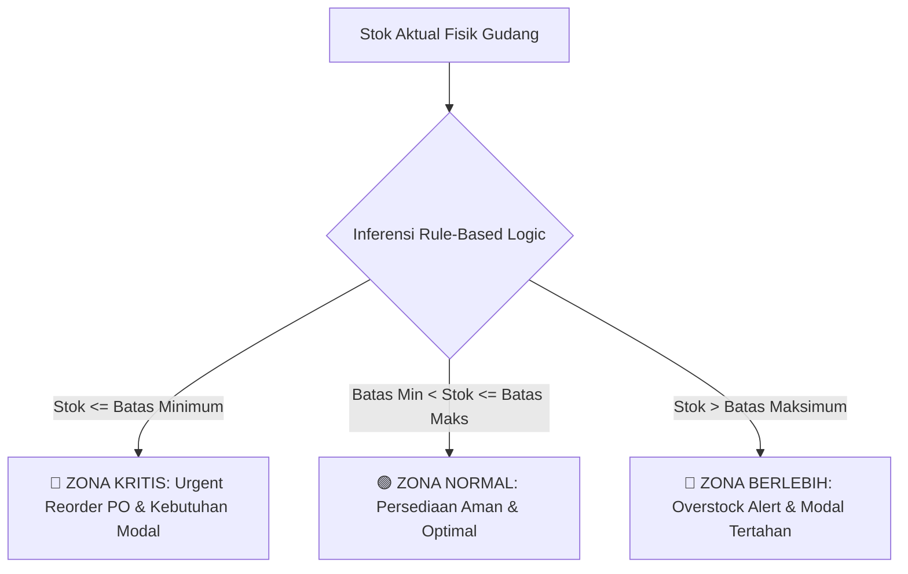

<p align="center">
  
</p>

<h1 align="center">SANARTEX INVENTORY MANAGEMENT SYSTEM</h1>
<p align="center">
  <strong>Enterprise Finished Goods & Apparel Inventory Management with 3-Tier Rule-Based Logic (RBL) Buffer Control & C-Level Financial Intelligence</strong>
</p>

<p align="center">
  <a href="#-fitur-utama"></a>
  <a href="#-fitur-utama"></a>
  <a href="#-fitur-utama"></a>
  <a href="#-fitur-utama"></a>
  <a href="#-fitur-utama"></a>
  <a href="#-automated-testing"></a>
</p>

---

## 📌 Tentang Sistem SANARTEX Inventory

**SANARTEX Inventory System** adalah platform Enterprise Resource Planning (ERP) mini berbasis web yang dirancang khusus untuk operasional manufaktur dan pergudangan pakaian jadi (*Apparel Finished Goods*: Hoodie, Kaos, Kemeja, Jaket, Celana, Polo Shirt) pada **PT SANARTEX INDONESIA**.

Sistem ini menggabungkan algoritma inferensi persediaan **3-Tier Rule-Based Logic (RBL)**, manajemen keuangan pengadaan (*Purchasing & Nota Pembelian*), serta dashboard eksekutif **C-Level Executive Management (Top Tier)** untuk memantau likuiditas aset dan perputaran modal kerja (*Working Capital*).



---

## 🎯 3 Zona Klasifikasi RBL (*Rule-Based Logic*)

| Zona Buffer | Kondisi Matematis | Status Operasional | Rekomendasi Tindakan Sistem |
|---|---|---|---|
| 🔴 **Zona Kritis** | $\text{Stok} \le \text{Batas Minimum}$ | **Bahaya / Stockout Risk** | Otomatis hitung kuantitas pengadaan optimal $(\text{Max} - \text{Aktual})$ dan sarankan penerbitan PO ke supplier konveksi. |
| 🟢 **Zona Normal** | $\text{Batas Min} < \text{Stok} \le \text{Batas Maks}$ | **Optimal / Safety Stock** | Persediaan ideal untuk melayani pesanan toko cabang, outlet ritel, dan marketplace online. |
| 🔵 **Zona Berlebih** | $\text{Stok} > \text{Batas Maksimum}$ | **Overstock / Excess Capital** | Tahan order pengadaan baru dari vendor untuk mencegah modal kerja mati dan kelebihan kapasitas rak gudang. |

---

## 👑 5 Peran & Matriks Hak Akses (*Role-Based Access Control*)

Sistem menerapkan prinsip *Segregation of Duties* yang ketat dengan 5 peran pengguna:

| Menu Halaman | 🏢 Direksi / Manajemen | 👑 Superadmin | 👔 Kepala Gudang | 📦 Admin Gudang | 🛒 Purchasing |
|---|:---:|:---:|:---:|:---:|:---:|
| **Dashboard Workspace** | 🌟 C-Level BI | ⚡ Executive IT | 🏭 Gudang KPI | 📦 In/Out Fast | 💰 Pengadaan |
| **Katalog Pakaian Jadi** | ✅ | ✅ | ✅ | ✅ | ✅ |
| **Stok Masuk (Inbound Fisik)** | ✅ | ✅ | ✅ | ✅ | ❌ |
| **Nota Pembelian & PO (Faktur)** | ✅ | ✅ | ❌ | ❌ | ✅ |
| **Stok Keluar (Outbound)** | ✅ | ✅ | ✅ | ✅ | ❌ |
| **Analisis Buffer RBL (3 Zona)** | ✅ | ✅ | ✅ | ❌ | ✅ |
| **Laporan Mutasi & Valuasi** | ✅ | ✅ | ✅ | ❌ | ✅ |
| **Manajemen Pengguna (Users)** | ❌ | ✅ | ❌ | ❌ | ❌ |
| **Pengaturan Profil & SOP** | ✅ | ✅ | ✅ | ✅ | ✅ |

---

## ✨ Fitur-Fitur Unggulan

### 1. 🏢 Dashboard Intelijen Bisnis C-Level (*Top-Tier Management*)
- **Valuasi Aset Persediaan Fisik (Rp):** Menghitung total nilai rupiah seluruh pakaian jadi yang tersimpan di gudang secara real-time.
- **Analisis Modal Kerja (*Working Capital Analytics*):**
  - *Kebutuhan Modal Reorder:* Estimasi dana kas yang wajib dialokasikan untuk memulihkan stok zona kritis.
  - *Modal Tertahan Overstock:* Menghitung dana yang terikat pada produk yang melebihi batas maksimum buffer.
- **Dual Visual Intelligence:**
  - *Interactive Multi-Period Trend Chart:* Grafik tren arus barang masuk (+IN) vs pengeluaran (-OUT) dengan switcher periode: **Harian, Mingguan, 6 Bulan (Semester), dan 12 Bulan (Tahunan)**.
  - *Category Valuation Donut Chart:* Proporsi distribusi nilai aset per kategori produk pakaian jadi.
- **Evaluasi Kinerja Vendor:** Peringkat 5 supplier konveksi utama berdasarkan jumlah SKU, lead time (hari), dan total volume suplai.

### 2. 🧾 Modul Nota Pembelian & Faktur Pengadaan (*Purchasing & Finance*)
- Pencatatan transaksi belanja pakaian jadi terintegrasi harga beli per satuan, diskon potongan vendor, PPN (%), dan status pembayaran (**LUNAS / TEMPO / DP**).
- **Pelacakan Jatuh Tempo:** Pengingat otomatis untuk tagihan tempo yang mendekati batas waktu pelunasan.
- **Cetak Faktur Nota Standar Korporat A4:**
  - Kop surat resmi PT SANARTEX INDONESIA dengan alamat pabrik, NPWP, dan kontak.
  - Ejaan huruf nominal otomatis (*Terbilang Rupiah*).
  - 4 Kolom tanda tangan otorisasi (Purchasing, Checker QC, Vendor, Kepala Gudang).
  - Optimasi cetak presisi 1 halaman A4 (`@media print`).

### 3. 👕 Master Data Pakaian Jadi & Visual Buffer Gauge RBL
- **Katalog Terpadu Finished Goods:** Pengelolaan master data SKU produk apparel (Hoodie, Kaos, Kemeja, Jaket, Celana, Polo) lengkap dengan spesifikasi material teknis (ketebalan GSM, komposisi kain, tipe sablon/zipper), harga beli standar, dan vendor utama.
- **Visual 3-Zone Buffer Gauge Bar:**
  - Setiap baris katalog dilengkapi visual bar spektrum 3 warna yang merefleksikan posisi stok terhadap ambang batas:
    - 🔴 **Merah (Kritis):** $0 \dots \text{Min}$ (Risiko stockout)
    - 🟢 **Hijau (Normal):** $\text{Min} \dots \text{Max}$ (Rentang aman)
    - 🔵 **Biru (Berlebih):** $> \text{Max}$ (Overstock)
  - *Target Needle Indicator:* Titik (*dot*) hitam dinamis yang menunjukkan posisi stok fisik aktual secara presisi pada spektrum buffer.
- **Manajemen Lokasi Rak Fisik (*Warehouse Rack Allocation*):** Pemetaan lokasi rak spesifik untuk setiap SKU (misal: `Rak A-01 (Hoodie)`, `Rak B-01 (Kaos)`, `Rak F-02 (Cargo)`) guna mempercepat proses *putaway* barang masuk konveksi dan *picking* pesanan distribusi.
- **Full CRUD & Otorisasi Ketat:** Kepala Gudang dan Superadmin dapat menambah, mengubah parameter buffer/lead time, serta menghapus SKU dengan validasi integritas relasi mutasi.

### 4. 🛡️ Analisis Buffer RBL & Rekomendasi Reorder Cepat
- Pemetaan otomatis stok ke 3 zona keputusan (Kritis, Normal, Berlebih).
- Perhitungan kuantitas saran order optimal $(\text{Max Buffer} - \text{Stok})$ dan estimasi total anggaran PO.
- Konversi instan dari analisis rekomendasi reorder ke pencatatan transaksi masuk.

### 5. ⚡ Universal Realtime AJAX Table & Filter Engine
- **Debounced Live Search:** Pencarian instan real-time berdasarkan nama produk, SKU, spesifikasi bahan, vendor, nomor nota/surat jalan, atau lokasi rak fisik tanpa reload halaman.
- **Multi-Criteria Filtering:** Filter instan kategori apparel, status zona RBL (*Kritis, Menipis, Normal, Berlebih*), rentang tanggal, status pembayaran nota, dan supplier.
- **Multi-Option Sorting:** Pengurutan cepat berdasarkan Nama Produk (A-Z / Z-A), Stok Tertinggi/Terendah, dan Buffer Level Terendah.
- **Paginasi Terpadu:** Paginator responsif Tailwind CSS yang mempertahankan parameter filter aktif secara mulus.

### 6. 📷 Barcode Scanner Terintegrasi
- Pemindaian barcode SKU / QR code hangtag pakaian jadi langsung melalui **kamera peramban (laptop/smartphone)** atau **unggah berkas gambar label**.

---

## 🔐 Kredensial Akun Demo (Demo Logins)

Semua akun menggunakan kata sandi bawaan: **`password`**

| Role / Jabatan | Nama Pengguna | Email Login | Fokus Wewenang |
|---|---|---|---|
| 🏢 **Direksi / Manajemen** | Ir. Bambang Soediro, M.M. | `direksi@sanartex.com` | Pengawasan Eksekutif, Valuasi Aset & Kebijakan Likuiditas |
| 👑 **Superadmin** | Budi Santoso | `superadmin@sanartex.com` | Administrator Sistem, Master Data, Audit Trail & Manajemen User |
| 👔 **Kepala Gudang** | Hendra Wijaya | `kepala.gudang@sanartex.com` | Pengawasan Gudang, Analisis Buffer RBL, Mutasi & Laporan |
| 📦 **Admin Gudang** | Siti Nurhaliza | `admin.gudang@sanartex.com` | Penerimaan Masuk (+IN), Pengeluaran Keluar (-OUT) & Barcode |
| 🛒 **Purchasing** | Rian Pratama | `purchasing@sanartex.com` | Penerbitan Nota PO, Pelunasan Tempo & Saran Reorder RBL |

---

## 👕 Katalog Master Data Pakaian Jadi Bawaan (12 SKU)

| Kode SKU | Nama Produk Apparel | Kategori | Satuan | Lokasi Rak | Supplier Utama |
|---|---|---|---|---|---|
| `HD-OVS-BLK-01` | **Hoodie Oversize Heavyweight 330 GSM (Black)** | *Hoodie & Sweater* | `Pcs` | Rak A-01 | PT Garmen Konveksi Nusantara |
| `TS-CMB-WHT-02` | **Kaos Polos Combed 24s Cotton (White)** | *Kaos & T-Shirt* | `Pcs` | Rak B-01 | CV Kaos Prima Bandung |
| `KM-FLN-NAV-03` | **Kemeja Flannel Tartan Casual (Navy Grey)** | *Kemeja & Flannel* | `Pcs` | Rak C-01 | PT Busana Flannel Indah |
| `JK-BMB-OLV-04` | **Jaket Bomber Flight Waterproof (Olive)** | *Jaket & Outerwear* | `Pcs` | Rak D-01 | PT Garmen Outerwear Prima |
| `PL-PKT-GRY-05` | **Polo Shirt Pique Classic Fit (Charcoal)** | *Polo Shirt* | `Pcs` | Rak E-01 | CV Polo Mandiri Garmen |
| `CL-CHN-KHK-06` | **Celana Chino Slim Fit Stretch (Khaki)** | *Celana & Chino* | `Pcs` | Rak F-01 | PT Celana Karya Mandiri |
| `HD-ZPR-ASH-07` | **Hoodie Zipper Basic Fleece (Ash Grey)** | *Hoodie & Sweater* | `Pcs` | Rak A-02 | PT Garmen Konveksi Nusantara |
| `TS-OVS-SGE-08` | **Kaos Oversize Heavyweight 20s (Sage Green)** | *Kaos & T-Shirt* | `Pcs` | Rak B-02 | CV Kaos Prima Bandung |
| `JK-WND-BLK-09` | **Jaket Windbreaker Sport Active (Jet Black)** | *Jaket & Outerwear* | `Pcs` | Rak D-02 | PT Garmen Outerwear Prima |
| `SW-CRW-MST-10` | **Sweater Crewneck Minimalist (Mustard)** | *Hoodie & Sweater* | `Pcs` | Rak A-03 | PT Garmen Konveksi Nusantara |
| `CL-CRG-ARM-11` | **Celana Cargo Tactical 6-Pocket (Army Green)** | *Celana & Chino* | `Pcs` | Rak F-02 | PT Celana Karya Mandiri |
| `KM-OXF-BLU-12` | **Kemeja Oxford Long Sleeve Formal (Sky Blue)** | *Kemeja & Flannel* | `Pcs` | Rak C-02 | PT Busana Flannel Indah |

---

## 🚀 Panduan Instalasi & Menjalankan Aplikasi

### 1. Prasyarat Sistem
- **PHP** >= 8.2 (ekstensi `pdo`, `mbstring`, `openssl`, `tokenizer`, `xml`, `ctype`, `json`, `bcmath`)
- **Composer** >= 2.x
- **MySQL / MariaDB** >= 8.0 / 10.4
- **Node.js & NPM** (opsional untuk pengembangan aset)

### 2. Langkah Instalasi

```bash
# 1. Clone repository
git clone https://github.com/ikhsanoctav/Sanartex_Inventory.git
cd Sanartex_Inventory

# 2. Install dependensi PHP via Composer
composer install

# 3. Salin berkas environment
cp .env.example .env

# 4. Generate Application Key
php artisan key:generate

# 5. Konfigurasi kredensial database pada berkas .env
# DB_CONNECTION=mysql
# DB_HOST=127.0.0.1
# DB_PORT=3306
# DB_DATABASE=sanartex_inventori
# DB_USERNAME=root
# DB_PASSWORD=

# 6. Jalankan migrasi tabel dan seeding data awal (5 Role + 12 Produk)
php artisan migrate:fresh --seed

# 7. Jalankan development server
php artisan serve
```

Aplikasi dapat diakses melalui peramban web pada tautan: **`http://127.0.0.1:8000`**

---

## 🧪 Pengujian Otomatis (*Automated Testing*)

Aplikasi diverifikasi melalui pengujian fitur otomatis (*Feature & Unit Tests*) berbasis PHPUnit dengan cakupan isolasi otorisasi peran 100%:

```bash
php artisan test
```

Hasil Pengujian:
```text
PASS  Tests\Unit\RblEvaluatorTest
PASS  Tests\Feature\InventorySystemTest
PASS  Tests\Feature\NotificationTest
PASS  Tests\Feature\ProfileTest

Tests:    28 passed (170 assertions)
Duration: 2.15s
```

---

## 📁 Struktur Direktori Utama

```text
sanartex_inventori/
├── app/
│   ├── Http/Controllers/       # Controller (Dashboard, Product, Transaction, Rbl, Report, User, Profile)
│   ├── Models/                 # Model Eloquent (Product, StockInTransaction, StockOutTransaction, User)
│   ├── Providers/              # AppServiceProvider (Paginator default configuration)
│   └── Services/               # Logika Bisnis (RblEvaluatorService, NotificationService)
├── database/
│   ├── migrations/             # Skema tabel (products, stock_in, stock_out, users, settings, notifications)
│   └── seeders/                # Seeder 12 produk apparel pakaian jadi & 5 akun peran bawaan
├── public/
│   ├── favicon.ico             # Favicon resmi SANARTEX
│   └── img/                    # Asset logo (sanartex_horizontal, sanartex_stacked, emblem)
├── resources/
│   └── views/
│       ├── auth/               # Halaman Login
│       ├── dashboard/          # Dashboard utama + 5 Partial Workspaces per role (manajemen, superadmin, dll.)
│       ├── laporan/            # Laporan mutasi & valuasi persediaan
│       ├── layouts/            # Master layout (topbar, sidebar, scanner, ajax-filter)
│       ├── panduan/            # Panduan SOP RBL & operasional gudang
│       ├── products/           # Master Data Katalog Pakaian Jadi
│       ├── profile/            # Pengaturan Profil & Keamanan Akun
│       ├── purchasing/nota/    # Modul Nota Pembelian & Template Cetak Faktur Resmi A4
│       ├── rbl/                # Analisis 3-Zona Buffer RBL & Draft PO
│       ├── transaksi/          # Stok Masuk (Inbound) & Stok Keluar (Outbound)
│       ├── users/              # Manajemen Akun Staf & Hak Akses
│       ├── vendor/pagination/  # Template paginasi kustom Tailwind CSS
│       └── welcome.blade.php   # Landing page & RBL simulator
└── tests/
    └── Feature/                # Automated feature tests & Role isolation checks
```

---

## 📄 Lisensi

Sistem Informasi Inventori SANARTEX dikembangkan di bawah lisensi [MIT License](LICENSE).  
Hak Cipta &copy; 2026 **PT SANARTEX INDONESIA**. Seluruh hak cipta dilindungi undang-undang.
