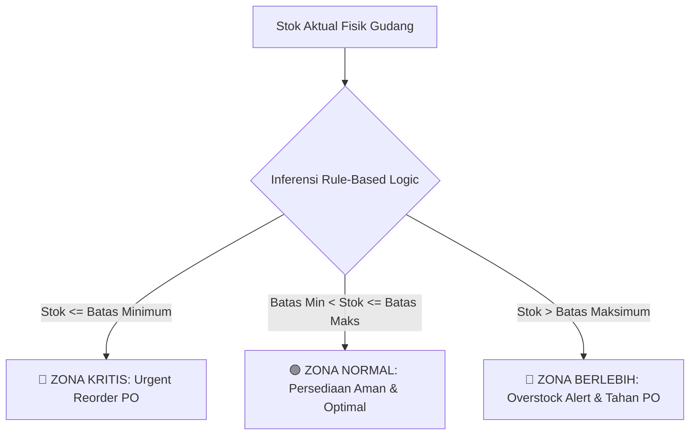

<p align="center">
  
</p>

<h1 align="center">SANARTEX INVENTORY MANAGEMENT SYSTEM</h1>
<p align="center">
  <strong>Enterprise Finished Goods & Apparel Inventory Management with 3-Tier Rule-Based Logic (RBL) Buffer Control</strong>
</p>

<p align="center">
  <a href="#-fitur-utama"></a>
  <a href="#-fitur-utama"></a>
  <a href="#-fitur-utama"></a>
  <a href="#-fitur-utama"></a>
  <a href="#-fitur-utama"></a>
  <a href="#-automated-testing"></a>
</p>

---

## 📌 Tentang Sistem SANARTEX Inventory

**SANARTEX Inventory System** adalah aplikasi manajemen persediaan pakaian jadi (*Apparel Finished Goods*: Hoodie, Kaos, Kemeja, Jaket, Celana, Polo Shirt) yang dirancang khusus untuk **PT SANARTEX INDONESIA**.

Sistem ini menerapkan algoritma inferensi **3-Tier Rule-Based Logic (RBL)** untuk memantau buffer persediaan secara otomatis dan real-time:



---

## 🎯 3 Zona Klasifikasi RBL (*Rule-Based Logic*)

| Zona Buffer | Kondisi Matematis | Status Operasional | Rekomendasi Tindakan Sistem |
|---|---|---|---|
| 🔴 **Zona Kritis** | $\text{Stok} \le \text{Batas Minimum}$ | **Bahaya / Stockout Risk** | Otomatis hitung kuantitas pengadaan optimal $(\text{Max} - \text{Aktual})$ dan sarankan penerbitan PO ke supplier konveksi. |
| 🟢 **Zona Normal** | $\text{Batas Min} < \text{Stok} \le \text{Batas Maks}$ | **Optimal / Safety Stock** | Persediaan ideal untuk melayani pesanan toko cabang, outlet ritel, dan marketplace online. |
| 🔵 **Zona Berlebih** | $\text{Stok} > \text{Batas Maksimum}$ | **Overstock / Excess Capital** | Tahan order pengadaan baru dari vendor untuk mencegah modal mati dan kelebihan kapasitas rak gudang. |

---

## ✨ Fitur-Fitur Utama

### 1. 👥 Ruang Kerja Khusus Berdasarkan Role (*Role-Based Workspaces*)
Setiap pengguna memiliki dasbor dengan fokus operasional yang dirancang khusus sesuai tugas dan wewenangnya:
- 👑 **Superadmin:** Overview eksekutif valuasi finansial persediaan, master data, konfigurasi parameter buffer RBL, manajemen akun staf, dan log audit trail.
- 👔 **Kepala Gudang:** Monitoring utilisasi kapasitas fisik gudang, zonasi blok rak (Rak A-01 s/d F-02), evaluasi buffer 3-zona, dan laporan rekapitulasi mutasi.
- 📦 **Admin Gudang:** Operasional cepat pencatatan penerimaan barang masuk konveksi (+IN) dengan status QC/batch, serta pengeluaran pesanan (-OUT) ke outlet ritel dengan validasi anti-stok minus.
- 🛒 **Purchasing:** Analisis produk kritis yang menipis, estimasi anggaran reorder buffer, generator *Purchase Order (PO)* otomatis, dan direktori vendor supplier.

### 2. 📈 Grafik Tren Arus Mutasi Multi-Periode Interaktif
Grafik analitik berbasis **Chart.js** yang dilengkapi tombol filter rentang waktu instan tanpa reload halaman:
- **Harian:** Pergerakan 14 hari terakhir per tanggal.
- **Mingguan:** Pergerakan 8 minggu terakhir (*weekly cycle*).
- **3 Bulan (Triwulan):** Analisis kinerja kuartalan.
- **6 Bulan (Semester):** Evaluasi tren semesteran (*default*).
- **Bulanan (12 Bulan):** Pola musiman tahunan (*seasonality*).
- *Sinkronisasi Dinamis:* Kotak metrik **Total Masuk**, **Total Keluar**, dan **Net Arus Stok** otomatis menyesuaikan periode terpilih dalam satuan **Pcs**.

### 3. ⚡ Universal Realtime AJAX Table & Filter Engine
- **Debounced Live Search:** Pencarian instan berdasarkan nama produk, kode SKU, atau rak tanpa perlu klik tombol submit.
- **Dropdown Multi-Filter:** Filter kategori pakaian jadi, status RBL, rentang tanggal, supplier, dan divisi outlet.
- **Transisi Cepat:** DOM swapping tanpa kedipan layar (*zero page reload*).

### 4. 📷 Scanner Barcode Terintegrasi
- Mendukung pemindaian barcode/QR hangtag pakaian jadi langsung melalui **kamera laptop/smartphone** atau **unggah berkas foto**.

### 5. 📑 Standarisasi Paginasi Responsif
- Template paginasi kustom Tailwind CSS di seluruh tabel data (`/products`, `/transaksi/masuk`, `/transaksi/keluar`, `/laporan`, `/users`).
- Mempertahankan parameter filter saat berpindah halaman (*URL query string preserved*).

---

## 🔐 Akun Login Bawaan (Demo Credentials)

Semua akun menggunakan kata sandi bawaan: **`password`**

| Role / Jabatan | Email Login | Hak Akses Utama |
|---|---|---|
| 👑 **Superadmin** | `superadmin@sanartex.com` | Kontrol Penuh, Master Data, Audit Trail & Users |
| 👔 **Kepala Gudang** | `kepala.gudang@sanartex.com` | Pengawasan Manajerial, Kapasitas Gudang & Zonasi Rak |
| 📦 **Admin Gudang** | `admin.gudang@sanartex.com` | Input Transaksi Masuk (+IN) & Keluar (-OUT) |
| 🛒 **Purchasing** | `purchasing@sanartex.com` | Analisis Reorder RBL & Generator Draft PO Supplier |

---

## 👕 Katalog Master Data Pakaian Jadi (12 SKU Bawaan)

| SKU | Nama Produk Apparel | Kategori | Satuan | Supplier Utama |
|---|---|---|---|---|
| `HD-OVS-BLK-01` | **Hoodie Oversize Heavyweight 330 GSM (Black)** | *Hoodie & Sweater* | `Pcs` | CV Konveksi Bandung Prima |
| `TS-CMB-WHT-02` | **Kaos Polos Combed 24s Cotton (White)** | *Kaos & T-Shirt* | `Pcs` | PT Garment Citra Pesona |
| `KM-FLN-NAV-03` | **Kemeja Flannel Tartan Casual (Navy Grey)** | *Kemeja & Flannel* | `Pcs` | CV Kreasi Busana Sejahtera |
| `JK-BMB-OLV-04` | **Jaket Bomber Flight Waterproof (Olive)** | *Jaket & Outerwear* | `Pcs` | PT Anugerah Apparel Solusi |
| `PL-PKT-GRY-05` | **Polo Shirt Pique Classic Fit (Charcoal)** | *Polo Shirt* | `Pcs` | PT Bintang Makmur Apparel |
| `CL-CHN-KHK-06` | **Celana Chino Slim Fit Stretch (Khaki)** | *Celana & Chino* | `Pcs` | CV Konveksi Bandung Prima |
| `HD-ZPR-ASH-07` | **Hoodie Zipper Basic Fleece (Ash Grey)** | *Hoodie & Sweater* | `Pcs` | PT Garment Citra Pesona |
| `TS-OVS-SGE-08` | **Kaos Oversize Heavyweight 20s (Sage Green)** | *Kaos & T-Shirt* | `Pcs` | PT Anugerah Apparel Solusi |
| `JK-WND-BLK-09` | **Jaket Windbreaker Sport Active (Jet Black)** | *Jaket & Outerwear* | `Pcs` | PT Bintang Makmur Apparel |
| `SW-CRW-MST-10` | **Sweater Crewneck Minimalist (Mustard)** | *Hoodie & Sweater* | `Pcs` | CV Kreasi Busana Sejahtera |
| `CL-CRG-ARM-11` | **Celana Cargo Tactical 6-Pocket (Army Green)** | *Celana & Chino* | `Pcs` | CV Konveksi Bandung Prima |
| `KM-OXF-BLU-12` | **Kemeja Oxford Long Sleeve Formal (Sky Blue)** | *Kemeja & Flannel* | `Pcs` | PT Garment Citra Pesona |

---

## 🚀 Panduan Instalasi & Menjalankan Aplikasi

### 1. Prasyarat Sistem
- **PHP** >= 8.2 (dengan ekstensi `pdo`, `mbstring`, `openssl`, `tokenizer`, `xml`, `ctype`, `json`)
- **Composer** >= 2.x
- **MySQL / MariaDB** >= 8.0 / 10.4
- **Node.js & NPM** (opsional untuk build aset)

### 2. Langkah Instalasi

```bash
# 1. Clone repository
git clone https://github.com/ikhsanoctav/Sanartex_Inventory.git
cd Sanartex_Inventory

# 2. Install dependensi PHP via Composer
composer install

# 3. Salin berkas konfigurasi environment
cp .env.example .env

# 4. Generate Application Key
php artisan key:generate

# 5. Konfigurasi database pada .env
# DB_CONNECTION=mysql
# DB_HOST=127.0.0.1
# DB_PORT=3306
# DB_DATABASE=sanartex_inventori
# DB_USERNAME=root
# DB_PASSWORD=

# 6. Jalankan migrasi dan seeding data awal
php artisan migrate --seed

# 7. Jalankan local development server
php artisan serve
```

Aplikasi dapat diakses melalui peramban web pada tautan: **`http://127.0.0.1:8000`**

---

## 🧪 Pengujian Otomatis (*Automated Testing*)

Aplikasi dilengkapi dengan rangkaian pengujian fitur otomatis (*Feature & Unit Tests*) menggunakan PHPUnit:

```bash
php artisan test
```

Hasil Pengujian:
```text
PASS  Tests\Unit\ExampleTest
PASS  Tests\Feature\ExampleTest
PASS  Tests\Feature\InventorySystemTest
PASS  Tests\Feature\NotificationTest
PASS  Tests\Feature\ProfileTest

Tests:    17 passed (79 assertions)
Duration: 1.34s
```

---

## 📁 Struktur Direktori Utama

```text
sanartex_inventori/
├── app/
│   ├── Http/Controllers/       # Controller per modul (Dashboard, Product, Transaksi, RBL, Laporan, User)
│   ├── Models/                 # Model Eloquent (Product, StockInTransaction, StockOutTransaction, User)
│   └── Services/               # Logika Bisnis (RblEvaluatorService, NotificationService)
├── database/
│   ├── migrations/             # Migrasi skema database & relasi
│   └── seeders/                # Seeder 12 produk apparel & 4 role pengguna
├── public/
│   ├── favicon.ico             # Favicon resmi SANARTEX
│   └── img/                    # Asset logo (sanartex_horizontal, sanartex_stacked, emblem)
├── resources/
│   └── views/
│       ├── auth/               # Halaman Login
│       ├── dashboard/          # Dashboard terpadu + 4 Partial Workspaces per role
│       ├── laporan/            # Laporan mutasi & valuasi persediaan
│       ├── layouts/            # Master layout (topbar, sidebar, scanner, ajax-filter)
│       ├── panduan/            # Panduan SOP RBL
│       ├── products/           # Master Data Katalog Pakaian Jadi
│       ├── profile/            # Pengaturan Profil & Keamanan Akun
│       ├── rbl/                # Analisis 3-Zona Buffer RBL & Generator PO
│       ├── transaksi/          # Stok Masuk (Inbound) & Stok Keluar (Outbound)
│       ├── users/              # Manajemen Akun Staf & Role
│       ├── vendor/pagination/  # Template paginasi kustom Tailwind
│       └── welcome.blade.php   # Landing page & RBL interactive simulator
└── tests/
    └── Feature/                # Automated feature tests
```

---

## 📄 Lisensi

Sistem Informasi Inventori SANARTEX dikembangkan di bawah lisensi [MIT License](LICENSE).
Hak Cipta &copy; {{ date('Y') }} **PT SANARTEX INDONESIA**. Seluruh hak cipta dilindungi undang-undang.
