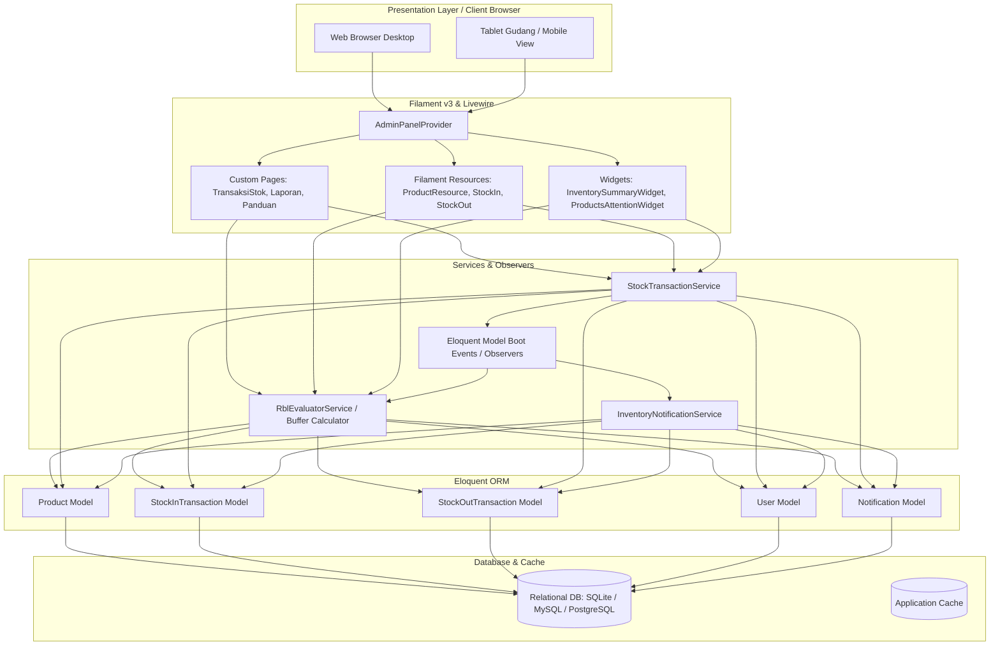
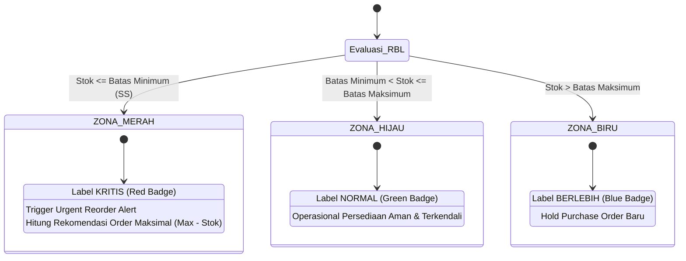
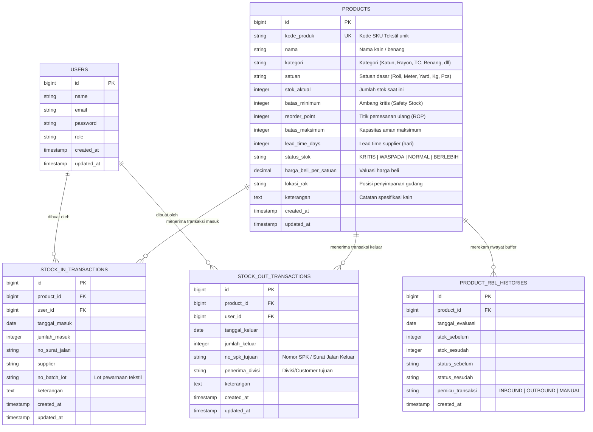
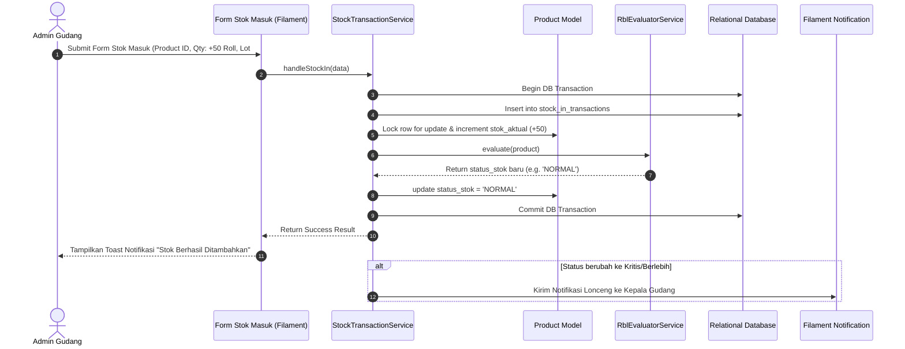
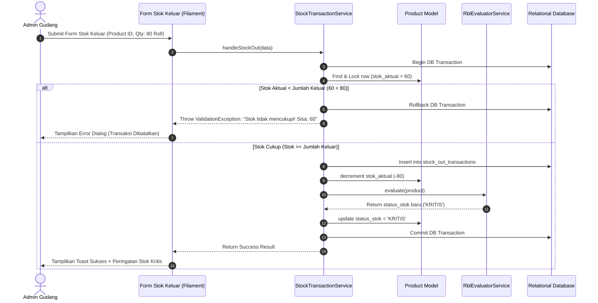

# Software Design Document (SDD)
## Arsitektur & Desain Sistem Inventori Tekstil Berbasis Rule-Based Logic & Buffer Level (RBL)
**PT Saranatex (Sanartex)**

---

| **Standar Dokumen** | Mengacu pada IEEE Std 1016-2009 (*Systems and software engineering — Software design descriptions*) |
|---|---|
| **Dokumen ID** | SDD-SANARTEX-INV-01 |
| **Versi** | 2.0.0 (Redesain Berbasis RBL) |
| **Status** | Approved |
| **Tanggal Terbit** | 2 Oktober 2026 |
| **Platform** | Laravel 11/12, Filament v3, Livewire 3, Alpine.js, Tailwind CSS |

---

## 1. Pendahuluan & Tujuan Arsitektur

### 1.1 Tujuan
Dokumen Desain Perangkat Lunak (*Software Design Document* - SDD) ini mendefinisikan arsitektur tingkat tinggi (*high-level*), desain komponen terperinci (*low-level*), skema basis data (*database schema*), serta mekanisme logika bisnis **Rule-Based Logic & Buffer Level (RBL)** yang diterapkan pada sistem inventori PT Saranatex.

### 1.2 Prinsip Desain
1. **Separation of Concerns (SoC):** Pemisahan yang jelas antara lapisan antarmuka (*Presentation/Filament*), logika inferensi bisnis (*Domain Service/RBL Engine*), dan akses data (*Eloquent ORM / Repository*).
2. **Data Consistency & ACID Compliance:** Menjamin integritas perhitungan stok mutlak menggunakan transaksi basis data (*database transaction*) dan penanganan kondisi balapan (*race condition*).
3. **Reactive & Real-Time Feedback:** Perhitungan status buffer dan indikator visual bereaksi seketika saat data transaksi disimpan.
4. **Maintainability & Extensibility:** Kode dirancang modular agar mudah ditambahkan fungsionalitas baru seperti integrasi barcode scanner 2D, purchase order otomatis, atau multi-gudang.

---

## 2. Arsitektur Sistem Tingkat Tinggi (High-Level Architecture)

Aplikasi dibangun menggunakan arsitektur **Layered Modular MVC** yang dioptimalkan dengan **Filament v3 Component Architecture**:



---

## 3. Desain Logika Bisnis: Mesin Inferensi RBL (Rule-Based Logic)

### 3.1 Konsep Zonasi Buffer Tekstil (3-Zone RBL Model)
Sistem membagi tingkat persediaan ke dalam 3 zona buffer yang dievaluasi berurutan:



### 3.2 Algoritma Evaluasi & Pseudocode RBL
```php
class RblEvaluatorService
{
    public static function evaluate(Product $product): string
    {
        $stok = $product->stok_aktual;
        $min = $product->batas_minimum;
        $max = $product->batas_maksimum;

        if ($stok <= $min) {
            return 'KRITIS';   // Zona Merah
        } elseif ($stok <= $max) {
            return 'NORMAL';   // Zona Hijau
        } else {
            return 'BERLEBIH'; // Zona Biru
        }
    }
}
```

    public static function calculateSuggestedOrder(Product $product): int
    {
        if (in_array($product->status_stok, ['KRITIS', 'WASPADA'])) {
            return max(0, $product->batas_maksimum - $product->stok_aktual);
        }
        return 0;
    }
}
```

---

## 4. Desain Basis Data (Database Design & ERD)

### 4.1 Entity Relationship Diagram (ERD)



### 4.2 Struktur Tabel Detail & Kamus Data

#### Tabel `products`
| Kolom | Tipe Data | Keterangan & Aturan |
|---|---|---|
| `id` | BIGINT UNSIGNED (PK, AI) | Identifier unik produk |
| `kode_produk` | VARCHAR(50) (UNIQUE, Index) | Kode unik SKU kain (misal: `KTN-RYN-001`) |
| `nama` | VARCHAR(255) | Nama barang (misal: *Katun Twill 30s 58"*) |
| `kategori` | VARCHAR(100) (Index) | Kategori tekstil (*Kain Katun, Rayon, Benang, dll*) |
| `satuan` | VARCHAR(50) | Satuan unit (*Roll, Meter, Yard, Kg, Pcs*) |
| `stok_aktual` | INT | Stok saat ini (Default: 0, Tidak boleh negatif) |
| `batas_minimum` | INT | Ambang batas kritis bawah ($SS$) |
| `reorder_point` | INT (Nullable) | Titik pemesanan ulang ($ROP$) |
| `batas_maksimum` | INT | Kapasitas batas atas buffer ($Max$) |
| `lead_time_days` | INT (Default: 7) | Lead time pengadaan dari supplier (hari) |
| `status_stok` | ENUM / VARCHAR(30) | `KRITIS`, `WASPADA`, `NORMAL`, `BERLEBIH` |
| `lokasi_rak` | VARCHAR(100) (Nullable) | Posisi rak gudang (misal: *Gudang A - Rak 04*) |

#### Tabel `stock_in_transactions`
| Kolom | Tipe Data | Keterangan |
|---|---|---|
| `id` | BIGINT UNSIGNED (PK, AI) | Identifier transaksi masuk |
| `product_id` | BIGINT UNSIGNED (FK) | Relasi ke `products.id` (*cascade delete*) |
| `user_id` | BIGINT UNSIGNED (FK, Nullable) | Relasi ke `users.id` (operator pembuat) |
| `tanggal_masuk` | DATE | Tanggal penerimaan barang fisik |
| `jumlah_masuk` | INT | Kuantitas barang masuk (> 0) |
| `no_surat_jalan` | VARCHAR(100) (Nullable) | Nomor Surat Jalan / Faktur dari Supplier |
| `supplier` | VARCHAR(150) (Nullable) | Nama supplier atau pabrik pencelupan |
| `no_batch_lot` | VARCHAR(100) (Nullable) | Nomor Lot / Batch pencelupan tekstil |
| `keterangan` | TEXT (Nullable) | Catatan kondisi fisik kain |

#### Tabel `stock_out_transactions`
| Kolom | Tipe Data | Keterangan |
|---|---|---|
| `id` | BIGINT UNSIGNED (PK, AI) | Identifier transaksi keluar |
| `product_id` | BIGINT UNSIGNED (FK) | Relasi ke `products.id` (*cascade delete*) |
| `user_id` | BIGINT UNSIGNED (FK, Nullable) | Relasi ke `users.id` (operator pembuat) |
| `tanggal_keluar` | DATE | Tanggal pengeluaran barang fisik |
| `jumlah_keluar` | INT | Kuantitas barang keluar (> 0) |
| `no_spk_tujuan` | VARCHAR(100) (Nullable) | Nomor SPK Konveksi / Faktur Penjualan |
| `penerima_divisi`| VARCHAR(150) (Nullable) | Divisi Cutting / Sewing / Customer |
| `keterangan` | TEXT (Nullable) | Alasan pengeluaran barang |

---

## 5. Diagram Alur Transaksi & Evaluasi RBL (Sequence Diagrams)

### 5.1 Alur Transaksi Stok Masuk & Evaluasi RBL



### 5.2 Alur Transaksi Stok Keluar dengan Proteksi Validasi Minus



---

## 6. Desain Keamanan & Penanganan Konkurensi (*Concurrency Control*)

1. **Pessimistic Locking (`lockForUpdate`):**
   Untuk mencegah *race condition* ketika dua operator gudang melakukan pengeluaran barang yang sama secara bersamaan, setiap mutasi stok dieksekusi dalam blok transaksi terisolasi:
   ```php
   DB::transaction(function () use ($productId, $qty) {
       $product = Product::where('id', $productId)->lockForUpdate()->first();
       
       if ($product->stok_aktual < $qty) {
           throw new \Exception("Stok tidak mencukupi.");
       }
       
       $product->stok_aktual -= $qty;
       $product->status_stok = RblEvaluatorService::evaluate($product);
       $product->save();
   });
   ```
2. **Audit Logging & User Traceability:**
   Setiap mutasi barang secara otomatis merekam `user_id` yang sedang terautentikasi melalui session Laravel.

---

## 7. Rencana Integrasi & Strategi Penerapan

1. **Database Migration Strategy:** Migrasi tabel `products` untuk penambahan kolom RBL (`reorder_point`, `lead_time_days`, `lokasi_rak`, `harga_beli_per_satuan`).
2. **Backward Compatibility:** Data stok lama tetap utuh dengan menjalankan migration script pengisian default RBL dari rasio `batas_minimum` dan `batas_maksimum`.
3. **Automated Unit Testing:** Penyusunan test suite pada `tests/Unit/RblEvaluatorTest.php` untuk memvalidasi keempat aturan zona buffer RBL.
