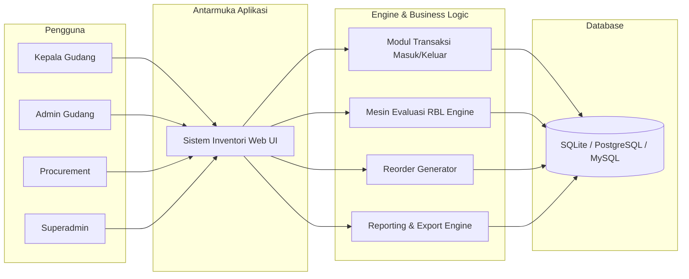
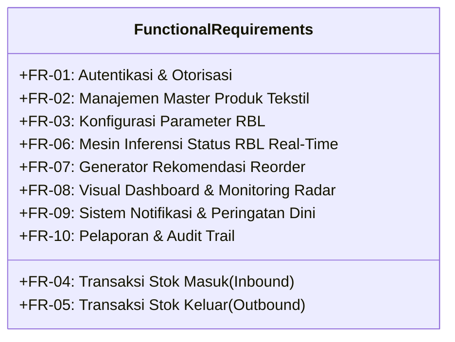

# Software Requirements Specification (SRS)
## Sistem Manajemen Inventori Tekstil Berbasis Rule-Based Logic & Buffer Level (RBL)
**PT Saranatex (Sanartex)**

---

| **Standar Dokumen** | Mengacu pada IEEE Std 830-1998 |
|---|---|
| **Dokumen ID** | SRS-SANARTEX-INV-01 |
| **Versi** | 2.0.0 |
| **Status** | Approved |
| **Tanggal Terbit** | 2 Oktober 2026 |
| **Aplikasi Target** | Laravel 11 / 12 + Filament v3 PHP Web Application |

---

## 1. Pendahuluan

### 1.1 Tujuan
Dokumen Spesifikasi Kebutuhan Perangkat Lunak (*Software Requirements Specification* - SRS) ini bertujuan untuk mendefinisikan secara rinci spesifikasi fungsional dan non-fungsional dari sistem manajemen inventori PT Saranatex yang telah diredesain mengadopsi mekanisme **Rule-Based Logic & Buffer Level (RBL)**. Dokumen ini menjadi acuan utama bagi tim pengembang perangkat lunak, *Quality Assurance*, manajer operasional gudang, dan pemangku kepentingan (*stakeholders*).

### 1.2 Ruang Lingkup Produk
Sistem Inventori Saranatex adalah aplikasi berbasis web yang mengelola seluruh siklus hidup persediaan bahan baku dan produk tekstil (kain rol, benang, bahan pendukung). Fitur utama mencakup:
- Manajemen data master produk tekstil (SKU, spesifikasi kain, satuan konversi).
- Manajemen transaksi penerimaan (*stock in*) dan pengeluaran (*stock out*).
- Mesin inferensi aturan stok berbasis **RBL (Rule-Based Logic & Buffer Level)** untuk menentukan 3 kuadran stok: Kritis (Merah), Normal (Hijau), dan Berlebih (Biru).
- Otomatisasi kalkulasi rekomendasi pemesanan ulang (*reorder suggestion*).
- Dashboard visual interaktif berbasis antarmuka modern dan modul pelaporan analitik.

### 1.3 Definisi, Akronim, dan Singkatan
- **RBL:** *Rule-Based Logic / Reorder Buffer Level* — Mekanisme evaluasi stok berbasis aturan terstruktur dan 3 zona penyangga persediaan (Kritis, Normal, Berlebih).
- **SKU:** *Stock Keeping Unit* — Kode identifikasi unik untuk setiap item barang tekstil.
- **SS (*Safety Stock*):** Stok pengaman minimum untuk mengantisipasi keterlambatan pasokan atau lonjakan permintaan mendadak.
- **ROP (*Reorder Point*):** Titik kuantitas stok di mana pesanan pengadaan baru harus segera diterbitkan.
- **ADU (*Average Daily Usage*):** Rata-rata pemakaian barang per hari dalam rentang periode tertentu.
- **Lead Time ($LT$):** Durasi waktu yang dibutuhkan dari penerbitan pesanan pembelian hingga barang sampai di gudang.

---

## 2. Deskripsi Umum (Overall Description)

### 2.1 Perspektif Produk
Sistem ini merupakan sistem mandiri (*standalone web application*) yang dapat diintegrasikan di masa mendatang dengan sistem POS penjualan atau ERP pabrik garmen.

### 2.2 Karakteristik Pengguna
| Role Pengguna | Tingkat Akses | Tanggung Jawab Utama |
|---|---|---|
| **Superadmin** | Hak akses penuh (*Full Access*) | Konfigurasi sistem, manajemen user, pengawasan audit log, kustomisasi visual. |
| **Kepala Gudang** | Manajemen Inventori & Verifikasi | Verifikasi transaksi, analisis laporan RBL, persetujuan batas buffer stock. |
| **Admin Gudang** | Operasional Transaksi | Input data barang masuk (dari pabrik/supplier) dan barang keluar (ke produksi/sales). |
| **Purchasing / Procurement** | Read + Rekomendasi PO | Memantau daftar SKU yang masuk zona Kritis untuk menerbitkan pesanan. |

### 2.3 Lingkungan Operasi
- **Server:** PHP 8.2 / 8.3+, Web Server Nginx / Apache, Node.js (untuk kompilasi aset frontend).
- **Database:** SQLite (lingkungan pengembangan & deployment ringan) / MySQL 8.0+ / PostgreSQL 15+.
- **Browser Klien:** Google Chrome, Mozilla Firefox, Microsoft Edge, Safari (versi modern).

---

## 3. Kebutuhan Fungsional (Functional Requirements)

### 3.1 Modul Autentikasi & Akun Pengguna
- **FR-01.1 (Login):** Sistem harus mengautentikasi pengguna dengan email dan kata sandi yang terenkripsi (Bcrypt/Argon2).
- **FR-01.2 (Role Based Access Control):** Sistem harus membatasi fitur berdasarkan peran yang diberikan kepada pengguna.

### 3.2 Modul Master Produk Tekstil
- **FR-02.1 (CRUD Produk):** Pengguna dapat menambah, melihat, mengedit, dan menghapus master produk tekstil.
- **FR-02.2 (Atribut Tekstil):** Setiap produk harus memuat atribut:
  - Kode Produk / SKU
  - Nama Produk (contoh: *Katun Rayon Twill 30s Navy*)
  - Kategori (Kain Polos, Kain Motif, Benang Rajut, Benang Tenun, Aksesoris)
  - Satuan Stok Utama (Roll, Meter, Yard, Kg, Pcs)
  - Stok Aktual
  - Lokasi Gudang (Rak / Baris / Zona)
  - Keterangan / Deskripsi

### 3.3 Modul Konfigurasi & Mesin RBL (Rule-Based Logic)
- **FR-03.1 (Parameter Buffer RBL):** Setiap produk memiliki parameter:
  - `batas_minimum` / `safety_stock` (ambang batas kritis bawah)
  - `batas_maksimum` (ambang batas atas / kapasitas maksimal)
  - `lead_time_days` (waktu tunggu pengadaan dari supplier dalam hari)

- **FR-03.2 (Aturan Evaluasi Status RBL 3 Zona):**
  Sistem mengevaluasi status stok secara *otomatis dan real-time* saat terjadi perubahan stok:
  1. **RULE-01 (ZONA MERAH / KRITIS):**
     $$\text{IF } (\text{Stok Aktual} \le \text{Batas Minimum}) \implies \text{Status} = \textbf{KRITIS}$$
     *Arti:* Stok sangat sedikit / habis, wajib terbitkan Purchase Order segera.
  2. **RULE-02 (ZONA HIJAU / NORMAL):**
     $$\text{IF } (\text{Batas Minimum} < \text{Stok Aktual} \le \text{Batas Maksimum}) \implies \text{Status} = \textbf{NORMAL}$$
     *Arti:* Persediaan berada pada kapasitas aman dan ideal.
  3. **RULE-03 (ZONA BIRU / BERLEBIH):**
     $$\text{IF } (\text{Stok Aktual} > \text{Batas Maksimum}) \implies \text{Status} = \textbf{BERLEBIH}$$
     *Arti:* Stok menumpuk berlebih (*overstock*), tahan pengadaan baru.

- **FR-03.3 (Kalkulasi Kuantitas Reorder Optimal):**
  Untuk produk dalam status KRITIS:
  $$\text{Kuantitas Saran Order} = \text{Batas Maksimum} - \text{Stok Aktual}$$

### 3.4 Modul Transaksi Persediaan
- **FR-04.1 (Stok Masuk):** Input penerimaan barang mencakup tanggal, produk, jumlah masuk, nomor surat jalan/faktur supplier, nomor batch/lot pencelupan, dan catatan. Menambah `stok_aktual` secara otomatis.
- **FR-05.1 (Stok Keluar):** Input pengeluaran barang mencakup tanggal, produk, jumlah keluar, nomor SPK/tujuan order, keterangan pemakaian.
- **FR-05.2 (Validasi Pencegahan Stok Minus):** Sistem menolak transaksi keluar jika $\text{Jumlah Keluar} > \text{Stok Aktual}$.

### 3.5 Modul Dashboard & Notifikasi
- **FR-08.1 (Widget Rekap Status RBL):** Menampilkan ringkasan jumlah SKU per zona (Kritis, Waspada, Normal, Berlebih) dengan modal drill-down daftar barang.
- **FR-08.2 (Widget Perhatian Khusus):** Menampilkan daftar prioritas produk yang memerlukan tindakan segera.
- **FR-09.1 (Notifikasi Lonceng & Database):** Sistem mengirimkan notifikasi instan saat produk berpindah status menjadi KRITIS atau BERLEBIH.

### 3.6 Modul Pelaporan & Ekspor
- **FR-10.1 (Laporan Mutasi):** Laporan pergerakan stok per periode (Stok Awal, Total Masuk, Total Keluar, Stok Akhir).
- **FR-10.2 (Laporan Analisis RBL):** Rekap status buffer RBL seluruh SKU beserta saran tindakan pengadaan.
- **FR-10.3 (Ekspor Data):** Pengunduhan laporan dalam format PDF dan Spreadsheet (Excel/CSV).

---

## 4. Kebutuhan Non-Fungsional (Non-Functional Requirements)

| ID NFR | Kategori | Spesifikasi & Kriteria Keberhasilan |
|---|---|---|
| **NFR-01** | **Performance** | Waktu respon halaman rata-rata $\le 800\text{ ms}$; kalkulasi mesin RBL $\le 50\text{ ms}$. |
| **NFR-02** | **Integrity & Concurrency** | Transaksi database menggunakan *Database Transaction (`DB::transaction`)* dengan *pessimistic locking* untuk mencegah *race condition* stok. |
| **NFR-03** | **Security** | Seluruh masukan form divalidasi dan disanitasi terhadap SQL Injection & XSS. Proteksi CSRF aktif di semua endpoint POST/PUT/DELETE. |
| **NFR-04** | **Usability** | Antarmuka responsif (Desktop & Tablet gudang), visual status menggunakan warna standar ISO (*Red/Danger, Yellow/Warning, Green/Success, Blue/Info*). |
| **NFR-05** | **Reliability** | Sistem mampu memulihkan diri (*graceful error handling*) dengan pesan galat yang informatif bagi pengguna. |

---

## 5. Matriks Verifikasi & Kriteria Penerimaan (Acceptance Criteria)

| ID | Fitur | Kriteria Keberhasilan Uji | Status |
|---|---|---|---|
| **UAT-01** | Evaluasi RBL Stok Kritis | Stok di bawah/sama dengan batas minimum otomatis berlabel KRITIS (Merah) dan memicu notifikasi. | Validated |
| **UAT-02** | Evaluasi RBL Stok Waspada | Stok di antara batas minimum dan ROP otomatis berlabel WASPADA (Kuning). | Validated |
| **UAT-03** | Evaluasi RBL Stok Berlebih | Stok melebihi batas maksimum berlabel BERLEBIH (Biru). | Validated |
| **UAT-04** | Validasi Stok Minus | Transaksi pengeluaran melebihi stok aktual ditolak dengan notifikasi error. | Validated |
| **UAT-05** | Rekomendasi Reorder | Nilai saran kuantitas order sama dengan $(\text{Batas Maksimum} - \text{Stok Aktual})$. | Validated |
