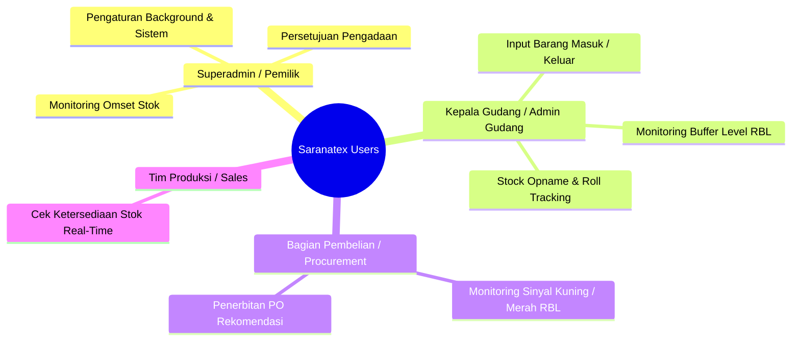

# Product Requirements Document (PRD)
## Sistem Manajemen Inventori Tekstil Berbasis RBL (Rule-Based Logic & Buffer Level)
**PT Saranatex (Sanartex)**

---

| **Dokumen ID** | PRD-SANARTEX-INV-01 |
|---|---|
| **Versi** | 2.0.0 (Redesain Berbasis RBL) |
| **Status** | Approved / Baseline |
| **Target Rilis** | Q4 2026 |
| **Author** | Tim Rekayasa Sistem & Inventori Saranatex |
| **Domain Industri** | Tekstil, Kain, Benang, & Garmen |

---

## 1. Executive Summary & Visi Produk

### 1.1 Latar Belakang
PT Saranatex adalah perusahaan yang bergerak di bidang distribusi dan manufaktur tekstil (kain rol, benang, aksesoris garmen). Pengelolaan stok tekstil memiliki karakteristik unik dan kompleks:
1. **Fluktuasi Permintaan:** Permintaan kain musiman dan pesanan garmen dengan *deadline* ketat.
2. **Variasi Lead Time Supplier:** Waktu tunggu dari pabrik tenun/rajut dan pencelupan (*dyeing & finishing*) berkisar antara 7 hingga 30 hari.
3. **Risiko Double Impact:**
   - **Stok Kritis (*Stockout*):** Terhentinya proses produksi garmen, denda keterlambatan, atau kehilangan penjualan.
   - **Stok Berlebih (*Overstock*):** Beban modal kerja (*capital lock*), risiko kerusakan fisik kain (jamur, luntur, penuaan serat, debu gudang), serta penyusutan nilai pasar (*dead stock*).

### 1.2 Visi Produk
Membangun platform inventori cerdas, *real-time*, dan adaptif berbasis **RBL (Rule-Based Logic & Buffer Level)** yang memantau kondisi stok tekstil secara presisi, mengotomatisasi peringatan dini stok kritis dan berlebih, serta memberikan rekomendasi pengadaan ulang (*reorder*) yang terukur.

---

## 2. Tujuan & Key Performance Indicators (KPIs)

| Kategori KPI | Target Metric | Dampak Bisnis |
|---|---|---|
| **Pencegahan Stockout** | Penurunan insiden *out-of-stock* kain utama hingga **< 2%** | Menjamin kelancaran supply line produksi garmen |
| **Reduksi Overstock** | Penurunan nilai barang tertimbun/deadstock hingga **25%** | Efisiensi modal kerja dan optimalisasi kapasitas gudang |
| **Akurasi Stok** | Akurasi pencatatan stok fisik vs sistem **≥ 99.2%** | Menghilangkan selisih stok saat audit & stock opname |
| **Efisiensi Pengadaan** | Pembuatan Purchase Order otomatis via RBL memangkas waktu planning **70%** | Mempercepat siklus pengadaan material tekstil |

---

## 3. Persona Pengguna & User Journey

### 3.1 Persona



1. **Kepala Gudang / Inventory Manager:** Bertanggung jawab atas akurasi fisik gudang, kontrol pergerakan rol kain, dan kepatuhan batas buffer RBL.
2. **Admin Gudang (Operator In/Out):** Melakukan input transaksi penerimaan (Surat Jalan/Supplier) dan pengeluaran (Surat Perintah Kerja/Sales).
3. **Procurement / Purchasing Officer:** Memanfaatkan rekomendasi RBL untuk membuat pesanan ke pabrik tekstil.
4. **Superadmin / Manajemen Eksekutif:** Memantau laporan valuasi stok, performa turnover kain, dan KPI gudang.

---

## 4. Konsep Inti & Logika RBL (Rule-Based Logic & Buffer Level)

Sistem mengadopsi model **3-Tier Buffer Level RBL** yang disederhanakan dan disesuaikan untuk karakteristik tekstil:

```mermaid
graph TD
    A[Stok Aktual Barang] --> B{Evaluasi Aturan RBL}
    B -->|Stok <= Safety Stock (Batas Min)| C[ZONA MERAH: KRITIS / REORDER]
    B -->|Batas Min < Stok <= Batas Maksimum| D[ZONA HIJAU: NORMAL / OPTIMAL]
    B -->|Stok > Batas Maksimum| E[ZONA BIRU: BERLEBIH / OVERSTOCK]
    
    C --> F[Notifikasi Urgent + Rekomendasi PO Pengadaan]
    D --> G[Operasional Normal]
    E --> H[Alert Hold Pengadaan + Evaluasi Kapasitas]
```

### 4.1 Definisi Formula RBL
1. **Average Daily Usage ($ADU$):** Rata-rata konsumsi harian barang dalam $N$ hari terakhir (default: 30 hari).
   $$\text{ADU} = \frac{\sum \text{Pengeluaran (Yard/Meter/Kg/Roll)}}{N}$$
2. **Safety Stock ($SS$ / Batas Minimum / Kritis):**
   $$SS = \text{ADU} \times \text{Safety Days} \quad \text{atau input statis parameter master}$$
3. **Batas Maksimum ($Max Buffer$):**
   $$Max = SS + (\text{ADU} \times \text{Order Cycle Days}) \quad \text{atau kapasitas gudang maksimum}$$

---

## 5. Fitur Utama Sistem (Scope of Work)

### 5.1 Modul Master Data Tekstil
- Manajemen SKU produk tekstil dengan atribut lengkap: Kode Kain, Nama Kain, Kategori (Katun, Rayon, TC, Poliester, Benang, Aksesoris), Satuan Utama (Roll/Gulung), Satuan Turunan (Yard, Meter, Kg), Konversi Satuan, Lokasi Rak Gudang.
- Parameter RBL per produk: Batas Minimum ($SS$), Batas Maksimum ($Max$), Lead Time (hari), Supplier Utama.

### 5.2 Modul Transaksi & Pencatatan Roll
- **Stok Masuk (Inbound):** Pencatatan penerimaan dari supplier/pabrik finishing, nomor lot/batch pewarnaan, nomor surat jalan, jumlah rol dan total yardage/meter.
- **Stok Keluar (Outbound):** Pengurangan stok untuk penjualan, pengiriman ke konveksi, atau pemakaian sampling. Validasi stok aktual tidak boleh minus.
- **Histori Transaksi:** Audit trail lengkap pergerakan stok real-time dengan pencatat waktu dan operator.

### 5.3 Modul Mesin RBL & Rekomendasi Pengadaan
- Evaluasi otomatis status stok setiap terjadi transaksi masuk/keluar.
- Penentuan status: **KRITIS (Merah)**, **NORMAL (Hijau)**, **BERLEBIH (Biru)**.
- *Generator Rekomendasi PO:* Kalkulasi jumlah pemesanan optimal:
  $$\text{Kuantitas Rekomendasi} = \text{Batas Maksimum} - \text{Stok Aktual}$$

### 5.4 Dashboard Interaktif & Alerting
- Ringkasan KPI: Total SKU, Valuasi Stok, SKU Kritis, SKU Optimal, SKU Berlebih.
- Visual Health Bar RBL pada setiap item barang (3 Zona).
- Notifikasi real-time ke panel admin dan push alert untuk stok kritis.

### 5.5 Modul Laporan & Analisis
- Laporan Mutasi Stok (Saldo Awal, Masuk, Keluar, Saldo Akhir).
- Laporan Analisis RBL (Status Buffer & Rekomendasi Tindakan).
- Laporan Fast-Moving vs Slow-Moving kain.
- Fitur Export PDF, Excel, dan Print Friendly View.

---

## 6. Non-Functional Requirements (NFR)

1. **Performa:** Waktu kalkulasi status RBL < 100ms per perubahan transaksi. Response time halaman dashboard < 1 detik.
2. **Ketersediaan (Availability):** Sistem beroperasi 99.9% uptime dengan SQLite/MySQL/PostgreSQL storage.
3. **Keamanan:** Autentikasi berbasis session terlindungi, CSRF protection, otorisasi berbasis Role (Superadmin, Admin Gudang, Viewer).
4. **Skalabilitas:** Mampu menampung hingga 50.000 SKU tekstil dan 500.000 record transaksi tahunan tanpa degradasi performa.

---

## 7. Roadmap Implementasi

| Fase | Durasi | Milestone |
|---|---|---|
| **Fase 1** | Minggu 1-2 | Redesain Database, Refactoring Model & Algoritma RBL Multi-Tier |
| **Fase 2** | Minggu 3-4 | Upgrade Filament Panel (Dashboard, Resource Kain, Transaksi Satuan Tekstil) |
| **Fase 3** | Minggu 5 | Implementasi Reorder Generator, Notifikasi Alerting Otomatis |
| **Fase 4** | Minggu 6 | Modul Laporan Komprehensif (PDF/Excel), UAT & Pelatihan Staf Saranatex |
